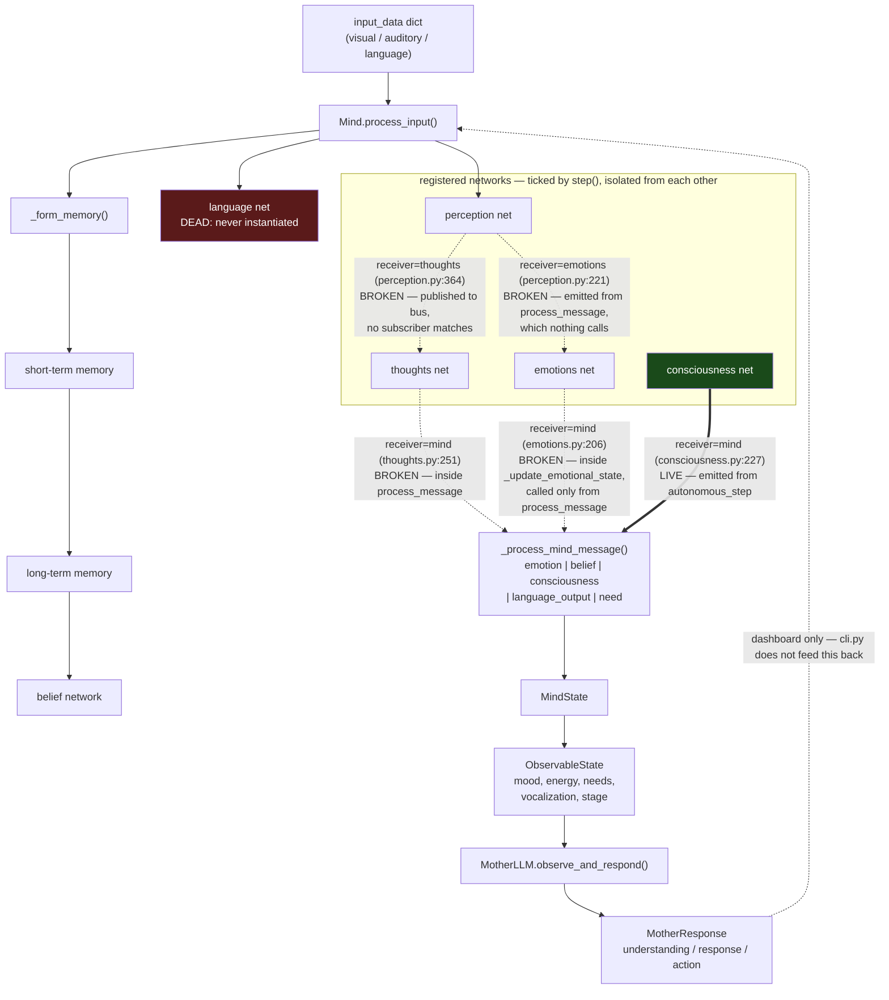

# NeuralChild — Architecture

Every claim below is tagged **CURRENT** (true of the code today) or **PLANNED / NOT IMPLEMENTED**.
Per-file detail lives in [`docs/modules/`](modules/); the predecessor repo is documented in
[`docs/legacy-neural-child/`](legacy-neural-child/); design aspirations are in [`docs/ideas.md`](ideas.md).

## 1. What this is

A developmental cognitive simulation. A central `Mind` owns a registry of `NeuralNetwork` sub-networks
(perception, emotions, thoughts, consciousness, and an unused language network), a two-tier memory store,
a subject-predicate-object belief graph, and a seven-need motivation system, all advanced one tick at a
time by `Mind.step()`. An LLM-backed `MotherLLM` caregiver observes only `ObservableState` — mood, energy,
expressed needs, vocalization, stage — never the internal state, and replies with nurturing text drawn
from either a template bank or a local LM Studio server.

**CURRENT status:** the scaffolding is complete and the mother path works end to end, but the
network-to-network message layer is not connected to anything. The simulation cannot leave the INFANT
stage. See [§8 Blocking defects](#8-blocking-defects).

## 2. Component map

| File | Role | Status |
|---|---|---|
| [`mind/mind_core.py`](modules/mind/mind_core.md) | `Mind` coordinator, memory, beliefs, needs, stage logic, persistence (2478 ln) | WIRED |
| [`core/schemas.py`](modules/core/schemas.md) | Shared models: `NetworkMessage`, `Memory`, `Belief`, `Need`, `DevelopmentalStage` | WIRED |
| [`mind/schemas.py`](modules/mind/schemas.md) | `MindState`, `ObservableState`, `Emotion`, `LanguageAbility` | WIRED |
| [`core/neural_network.py`](modules/core/neural_network.md) | `nn.Module` + ABC base: stage weights, learning, growth, save/load | PARTIALLY WIRED — learning and growth paths never execute |
| [`communication/message_bus.py`](modules/communication/message_bus.md) | In-process pub/sub with priority queues and history | PARTIALLY WIRED — only `"mind"` subscribes; history stays empty |
| [`mind/networks/consciousness.py`](modules/mind/networks/consciousness.md) | Awareness scalar + self-model RNN | PARTIALLY WIRED — `autonomous_step` live, `process_message` dead |
| [`mind/networks/perception.py`](modules/mind/networks/perception.md) | Visual+auditory fusion, valence/salience extraction | PARTIALLY WIRED — same |
| [`mind/networks/emotions.py`](modules/mind/networks/emotions.md) | Dict-based emotional state, valence buckets, decay | PARTIALLY WIRED — ticks and decays, never receives stimulus |
| [`mind/networks/thoughts.py`](modules/mind/networks/thoughts.md) | GRU thought vectors, template thought text, belief minting | PARTIALLY WIRED — same |
| [`mind/language.py`](modules/mind/language.md) | Vocabulary, syntax rules, sentence generation (1170 ln) | DEAD — `LanguageNetwork` is never instantiated anywhere |
| [`mother/mother_llm.py`](modules/mother/mother_llm.md) | Caregiver: observes `ObservableState`, emits `MotherResponse` | WIRED |
| [`utils/llm_module.py`](modules/utils/llm_module.md) | OpenAI-protocol chat/embeddings client with retry | WIRED |
| [`config.py`](modules/config.md) + `config.yaml` | Pydantic config tree, YAML load, logging setup | WIRED |
| [`cli.py`](modules/cli.md) | Argparse front end, step loop, console dashboard | PARTIALLY WIRED — never calls `mind.process_input()` |
| [`neural-child-dashboard.py`](modules/neural-child-dashboard.md) | Dash/Plotly UI, background sim thread, checkpoints | DEAD — `app.run_server()` raises on Dash 4.x |
| [`run_dashboard.py`](modules/run_dashboard.md) | Dependency check + subprocess launcher | PARTIALLY WIRED — launches a child that cannot start |
| [`pyproject.toml`](modules/pyproject.md) | Packaging; `packages = ["neuralchild"]` | PARTIALLY WIRED — no `neuralchild/` package exists (flat layout) |
| `utils/serialization.py`, `tests/*.py`, all `__init__.py` | — | EMPTY (2-byte stubs) |
| `visualization/` | Obsidian export | EMPTY — both stubs deleted, path abandoned |

## 3. The step cycle

`Mind.step()` (mind_core.py:1051) executes this fixed order every tick. **CURRENT.**

| # | Call | Gate | Notes |
|---|---|---|---|
| 1 | `process_messages()` | none | Drains the mind's own bus queue |
| 2 | per network: `generate_text_output()` | none | Called unguarded on every network |
| 3 | per network: `autonomous_step()` | `hasattr` check | The only live network entry point |
| 4 | per network: `_retrieve_network_messages()` | none | Drains `state.parameters["pending_messages"]` |
| 5 | `_update_needs()` | `need_update_interval` | Base drift 0.0003/s scaled by stage priority |
| 6 | `_consolidate_memories()` | `memory_consolidation_interval` | Short-term → long-term, then decay |
| 7 | `_update_belief_system()` | hardcoded 60.0 s (mind_core.py:1528) | Not config-driven, unlike its neighbours |
| 8 | `_check_network_growth()` | `network_growth_check_interval` | Calls `clone_with_growth()` — always throws |
| 9 | `_update_mind_state()` | none | Aggregates network states into `MindState` |
| 10 | `_check_developmental_progress()` | `development_check_interval` | Stage gate, see §5 |
| 11 | `_self_reflection()` | `self_awareness_level >= 0.3` | Inert; the field starts at 0.1 |

`simulation_time` accumulates the wall-clock duration of the step itself, not simulated time.
Step 4 routes messages addressed to `"mind"` straight into `_process_mind_message`; everything else is
published to the bus, where no subscriber matches.

## 4. Data flow



Exactly one inter-component message edge is live: `consciousness.autonomous_step()` → `Mind`. Every other
edge originates inside a `process_message()` body, and `process_message()` has **no call site anywhere in
the repo** (`core/neural_network.py:191` declares it abstract; all five networks implement it). **CURRENT.**

## 5. Developmental model

Five stages, `DevelopmentalStage` = INFANT 1, TODDLER 2, CHILD 3, ADOLESCENT 4, MATURE 5
(core/schemas.py:13, a plain `Enum`, so `>=` comparison raises — the code always compares `.value`).

Thresholds (mind_core.py:904-934). **All** metrics for the current stage must be met.

| Gate | emotions | vocabulary | beliefs | interactions | memories | consolidated | growth |
|---|---|---|---|---|---|---|---|
| INFANT → TODDLER | 3 | — | — | 20 | 10 | — | — |
| TODDLER → CHILD | 5 | 20 | — | 50 | 30 | 10 | — |
| CHILD → ADOLESCENT | 7 | 100 | 10 | 100 | 100 | 50 | — |
| ADOLESCENT → MATURE | 8 | 500 | 50 | 200 | 200 | 100 | 20 |

### Why the first gate cannot be passed — CURRENT

`emotions_experienced` is a `set`, and it has exactly one writer: `mind_core.py:1148`, in the `"emotion"`
branch of `_process_mind_message`. That branch is fed only by the message built at `emotions.py:206`,
inside `_update_emotional_state`, whose only call site is `emotions.py:125` — inside
`EmotionsNetwork.process_message`. Nothing calls `process_message`. The set therefore stays empty, `len()`
stays 0, and the `>= 3` requirement can never be satisfied.

Measured over 400 interactions with rich input: stage stayed INFANT, 0 emotions experienced, 0 beliefs,
0 consolidated memories, 0 long-term memories. The only escape hatch is
`config.mind.development_acceleration > 1.0`, which adds a per-check random skip probability of
`(mean_progress/100) * (accel - 1) * 0.1` (mind_core.py:1738) — a bypass, not a fix.

## 6. Memory and belief architecture — CURRENT (code present, starved of input)

```
_form_memory ──► short_term_memory      cap = 3 + 2 * stage.value   (INFANT: 5)
                       │
                       │  consolidation criteria (any one):
                       │    |emotional_valence| > 0.6
                       │    strength > 1.5
                       │    age > 300 s
                       ▼
                 long_term_memory ──► _cluster_memory()          (TODDLER+ only)
                       │         └──► belief_network.update_with_new_evidence()
                       ▼
                 decay 0.01/cycle   x0.5 if "emotionally_significant"
                                    x0.7 if "well_reinforced"
                 forget below 0.1   (raised to 0.3 INFANT, 0.2 TODDLER)
```

- **Valence-gated consolidation** — the `|valence| > 0.6` criterion is the intended fast path; without
  emotion messages, valence is whatever `process_input` computed, and the 300 s age rule does the work.
- **Clustering** — `MemoryCluster` groups memory IDs with an importance score. `centroid` is declared and
  serialized but never assigned; matching uses type/field equality instead (mind_core.py:1453).
- **Beliefs** — `Belief` is a subject-predicate-object triple with `confidence` (default 0.5), a
  `supporting_memories` list, and a stage tag. `update_confidence` is the arithmetic mean of old and new
  (`(c + e) / 2`, core/schemas.py:136) — recency-biased, asymptotic, never reaching 0 or 1, and *not*
  Bayesian despite the comment.
- **Contradiction resolution** — `resolve_contradictions` (mind_core.py:273) walks a
  `(id1, id2, strength)` list: if the two confidences differ by < 0.2 it shaves 0.05 × strength off both;
  otherwise it shaves 0.1 × strength off the weaker one only. Floor 0.1.
- **Relationships** — bidirectional, plus a memory→belief `evidence_index`. `_form_belief_relationships`
  can sum to 2.1 and passes that unclamped into `add_relationship`, documented as 0.0–1.0.
- **Needs** — seven needs with per-stage priority profiles; intensity drifts up, satisfaction decays
  0.0002/s, both histories capped at 100 entries.

## 7. The Mother contract

**CURRENT and verified working end to end against LM Studio**, including structured JSON responses.

- **Observable state only.** `MotherLLM` imports `Mind` purely for a type annotation and calls exactly one
  method on it: `get_observable_state()`. It sees `apparent_mood` (weighted emotion sum, clamped ±1),
  `energy_level`, `current_focus`, `recent_emotions`, `expressed_needs`, `vocalization`,
  `age_appropriate_behaviors`, `developmental_stage`. No memories, no beliefs, no network internals.
- **Rate gate.** Hardcoded 10.0 s wall clock (mother_llm.py:53). `last_response_time` advances only when a
  response is actually produced, so a suppressed turn leaves the gate open.
- **Respond-or-not.** Short-circuits true on any need > 0.7, any of fear/sadness/anger > 0.6, or any
  non-empty vocalization. Otherwise a per-stage coin flip: INFANT 0.8 → MATURE 0.3.
- **Template vs LLM.** `_generate_response` takes the template path when a template exists **and**
  `random() < 0.7`. Since all five stages define all four response types, the LLM is reached on roughly
  30% of responding turns. Template responses discard the constructed situation and technique and stamp a
  fixed `understanding` string; only the LLM path uses them.
- **Transport.** `utils/llm_module.chat_completion` POSTs `{model, messages, temperature}` to
  `config.server.llm_server_url`, default `http://localhost:1234/v1/chat/completions` — LM Studio speaking
  the OpenAI protocol. No `Authorization` header is sent. Timeout is **hardcoded at 30 s**
  (llm_module.py:90); retries default to 3 with 2.0 s base delay and 0.5–1.5× jitter.
- **Model selection.** `config.yaml` sets `model.llm_model` and `model.embedding_model`. That file names
  locally served models, so it is machine-specific and gitignored; it is absent from a fresh clone and
  `Config.from_yaml` falls back to the defaults in config.py. Any failure — outage, 4xx, unparseable
  JSON — is swallowed at mother_llm.py:627 and substituted with a canned template response, so an LLM
  outage is indistinguishable from a template turn in `interaction_history`.
- **Structured output caveat.** `structured_output=True` appends a *hardcoded* caregiver JSON schema to any
  caller's system prompt (llm_module.py:63-66); there is no way to request a different shape.

## 8. Blocking defects

Ranked by how much behaviour each one removes. **All CURRENT.**

| # | Defect | Location | Consequence |
|---|---|---|---|
| 1 | `process_message()` has no call site in the repo | declared `core/neural_network.py:191`; implemented in all 5 networks | Networks are mutually isolated. Emotions never fire, beliefs never form, memories never consolidate. |
| 2 | INFANT gate needs 3 distinct emotions; the counter's only writer is unreachable | gate `mind_core.py:907`, writer `mind_core.py:1148` ← `emotions.py:206` ← `emotions.py:125` | Simulation can never advance past INFANT. |
| 3 | `random` used without being imported | `core/neural_network.py:382, 386, 400, 402` | `NameError` once any network hits 100 experiences; uncaught inside `process_input`. |
| 4 | `clone_with_growth()` raises in all 5 networks | `AttributeError` first at `emotions.py:418` and `perception.py:481` (index 1 of the `Sequential` is `nn.ReLU`, which has no `out_features`); then `NameError` on `copy` and `NeuralGrowthRecord`, which none of the five subclass modules import — `consciousness.py:392`, `emotions.py:429`, `perception.py:495`, `thoughts.py:679`, `language.py:1139`. The base class imports both, but Python resolves names per-module. | Network growth has never executed. |
| 5 | CLI never feeds the child any input | loop at `cli.py:267-296` — no `mind.process_input()` call | `neuralchild` CLI runs a mind with zero sensory input. |
| 6 | Dashboard calls the Dash 2.x entry point | `neural-child-dashboard.py:1580` | `ObsoleteAttributeException` on Dash 4.0.0; the UI cannot start. |
| 7 | `save_state()` aborts mid-write once any memory exists, then reports success | dump at `mind_core.py:2263`; return value discarded at `neural-child-dashboard.py:360` | `memory.dict()` (`:2248`) leaves `developmental_stage` as a `DevelopmentalStage` enum, which `json.dump` cannot serialize. Measured with 5 short-term memories: `save_state` returns `False`, `memories.json` is truncated mid-write and unparseable, `beliefs.json` and `needs.json` are never created. The Save button still reports "Models successfully saved". Every checkpoint is unloadable. |
| 8 | `LanguageNetwork` never instantiated | `mind/language.py:84` (1170 ln) | Entire language subsystem is dead weight. |
| 9 | Learned vocabulary truncated to the language net's `vocabulary_size` by slicing an unordered set | `mind_core.py:1658` | Measured: 15 distinct words fed, 7 retained — arbitrary words destroyed every step. |
| 10 | Packaging declares a `neuralchild` package that does not exist | `pyproject.toml:38`, script at `:35` | `pip install .` yields a distribution whose console script cannot import. |
| 11 | Base-class `developmental_weights` seeded to 0.0 for every stage | `core/neural_network.py:153-155` | `effective_lr` is 0, so `experiential_learning` is a no-op until a stage update runs. |
| 12 | No tests | `tests/conftest.py`, `test_mind.py`, `test_mother.py`, `test_networks.py` — 2 bytes each | Nothing verifies any of the above. |

## 9. Predecessor project — EXTERNAL REFERENCE, NOT IN THIS REPO

`github.com/renatokuipers/neural-child` (2025, flat layout, archived). It is **not a dependency, not a
submodule, and not present in this tree** — only its per-file analysis lives here, under
[`docs/legacy-neural-child/`](legacy-neural-child/). Treat it as the **merge target**: it contains the
psychological depth this repo lacks, wrapped in code with its own severe defects.

| Subsystem it has that this repo lacks | Legacy file | Substance |
|---|---|---|
| Theory of mind | [`psychological_components.md`](legacy-neural-child/psychological_components.md) | 398-d social context → emotional/belief/intention/attention heads |
| Attachment | same | Bowlby-style: trust EMA, 4 attachment styles (secure/anxious/avoidant/disorganized), bonding features |
| Defense mechanisms | same | 7 heads (repression, projection, denial, sublimation, rationalization, displacement, regression) behind a learnable anxiety threshold |
| Metacognition | [`metacognition.md`](legacy-neural-child/metacognition.md) | Confidence / uncertainty / complexity heads + hypothesis sampling with a critic |
| Personality traits & drives | [`child_model.md`](legacy-neural-child/child_model.md) | `CoreDrives`: 5 drives + 5 personality traits, curiosity-gated activation masking |
| Moral policy | [`moral_network.md`](legacy-neural-child/moral_network.md) | Tanh moral score + two named sigmoid "safety filter" gates, hinge-loss `reinforce` |
| Symbol grounding | [`symbol_grounding.md`](legacy-neural-child/symbol_grounding.md) | Concept→embedding table with nearest-token retrieval |
| Prioritised replay | [`replay_system.md`](legacy-neural-child/replay_system.md) | Importance-weighted buffer with decay and pruning |
| 18-stage curriculum | [`curriculum_manager.md`](legacy-neural-child/curriculum_manager.md) | NEWBORN → MATURE_ADULT, 10 metric targets per stage, cosine-similarity scoring, regression detection — vs 5 stages and 7 counters here |
| Real training loop | [`training_system.md`](legacy-neural-child/training_system.md) | AdamW + cosine warm restarts, 4 weighted losses, checkpoint stability filtering, early stopping |

**The checkpoint tells the real story.** In `child_model.py`, `SensoryExperience` and `CoreDrives` are
plain Python classes assigned onto an `nn.Module`. Their `nn.Parameter`s therefore sit outside
`parameters()`, `state_dict()`, and `.to(device)`. The committed checkpoint confirms it: the sensory and
drive parameters were never registered as `nn.Module` members, never appeared in any optimizer, and so
**never trained**. `SensoryExperience.process_input` compounds this — it reads only its own learnable
vectors and ignores the stimulus entirely, emitting an identical 256-d output for every input.

Do not port that repo wholesale. It is CUDA-hardcoded throughout (no CPU path), its replay buffer breaks
permanently after one prune-then-refill cycle, its curriculum needs 30 real days per stage transition, and
its metacognition `self_correct` raises `IndexError` on most inputs. Port the **models**, not the code.

## 10. Roadmap — PLANNED / NOT IMPLEMENTED

Nothing in this section exists yet.

1. **Resurrect.** Dispatch `process_message()` from `Mind.step()` — either subscribe each network to the
   bus by name, or route `pending_messages` directly. Fix the missing `random` import (defect 3), the five
   `clone_with_growth` bodies (4), and the CLI input path (5). Target: a run that reaches TODDLER.
2. **Instrument.** Restore a working dashboard entry point (defect 6), and add tests that assert the
   milestone counters actually move — the current 2-byte stubs let every defect above ship silently.
3. **Port psychology.** Bring theory of mind, attachment, defense mechanisms, metacognition, personality
   traits, moral policy and symbol grounding across from the predecessor as new networks under
   `mind/networks/`, re-implemented against `NeuralNetwork` and device-agnostic. Widen the stage ladder
   toward the legacy 18-stage curriculum once the 5-stage one demonstrably advances.
4. **Perturbation experiments.** With a mind that develops and instrumentation that records it, vary the
   mother's personality traits, response interval and technique selection, and measure the effect on stage
   trajectory, belief consistency and emotional stability. This is the point of the project
   ([`docs/ideas.md`](ideas.md)); it is unreachable until steps 1–3 land.
