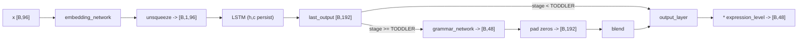

# language.py

Language subsystem of the mind: a `NeuralNetwork` subclass combining a small torch stack (MLP embedding → 2-layer LSTM → grammar MLP → linear head) with a symbolic vocabulary/syntax-rule store. Vocabulary acquisition, part-of-speech guessing, sentence generation and emotion-triggered utterances are all rule-based Python; the torch layers only produce the vector returned by `forward`. Developmental stage gates which rules, words and response templates are reachable.

## Public surface

| Name | Kind | Contract |
| --- | --- | --- |
| `VocabularyEntry` | pydantic model | Word record: text, acquisition time, usage count, familiarity 0–1, optional float-list embedding, `Set[str]` associations, optional POS. |
| `VocabularyEntry.increase_familiarity` | method | Adds amount (default 0.05), clamps to 1.0, increments usage count. |
| `VocabularyEntry.to_dict` | method | Plain-dict form; ISO timestamp, associations as list. |
| `SyntaxRule` | pydantic model | Rule id, POS pattern list, complexity, acquisition stage, mastery 0–1, example strings. |
| `SyntaxRule.increase_mastery` | method | Adds amount (default 0.05), clamps to 1.0. |
| `SyntaxRule.to_dict` | method | Plain-dict form; stage serialized by `.name`. |
| `LanguageNetwork` | class | Network named `"language"`; defaults input 96 / hidden 192 / output 48. |
| `.forward` | method | Tensor → tensor, stage-gated grammar blending, output scaled by expression level. |
| `.process_message` | method | Handles `language_input`, `emotion`, `query` message types; returns `VectorOutput` or `None`. |
| `.autonomous_step` | method | Probabilistic spontaneous utterance + association consolidation. |
| `.update_developmental_stage` | method | Calls super, sets ability constants, expands vocabulary, bumps rule mastery, clears LSTM state. |
| `.generate_text_output` | method | Human-readable `TextOutput` summarising the latest utterance, stage-dependent phrasing/confidence. |
| `.learn_from_interaction` | method | Reinforces word pairs shared between input and response; can mint new 2-slot syntax rules. |
| `.clone_with_growth` | method | Intended to return a dimension-scaled copy — raises `NameError` part-way through (see defects). |

## Key behaviour

- Constructor (language.py:92–174) builds `embedding_network` 96→192→(ReLU, Dropout 0.2)→96, `lstm` input 96 / hidden 192 / 2 layers / batch-first, `grammar_network` 192→192→48 with Dropout 0.3 + Sigmoid, `output_layer` Linear(192→48). `hidden_dim` is never stored; later code reads `self.lstm.hidden_size`.
- Seeds 5 words (mama, dada, no, yes, milk) at familiarity 0.3 and 6 syntax rules keyed `single_word` (mastery 0.8), `noun_verb`, `verb_noun`, `subject_verb_object`, `subject_verb_adjective`, `complex_sentence` (all mastery 0.0).
- `forward` (language.py:267–313): 2-D input gains a sequence axis; `self.hidden`/`self.cell` are lazily created as zeros [2, B, 192] and then **persisted across calls**. At TODDLER and above (`>=` on `stage.value`), grammar output [B,48] is right-padded with zeros to [B,192] and blended with `grammar_weight = min(1.0, 0.2*(stage.value-1))` before the head. Final result is multiplied by `language_ability.expression_level`.

- `process_message` (language.py:315–401): `language_input` resizes `vector_data` to `input_dim` by truncation or zero-padding, runs `forward` under `no_grad`; without vector data returns a one-hot-at-slot-0 vector. `emotion` (TODDLER+) generates a templated response, writes it out via `_send_language_output`, returns a vector with intensity at slot 1. `query` with `query_type == "language_ability"` returns [vocab/1000, complexity, understanding, expression] padded to `output_dim`.
- `_process_language_input` (language.py:403–510): non-alphabetic input short-circuits as `pre_linguistic` (understanding 0.1). Otherwise per word: known → familiarity +0.05; unknown → learned with probability `0.1 * stage.value * understanding_level`, embedding = 16 uniform(-1,1) floats. Recent utterances are capped at the last 10 (language.py:494, 756).
- `_generate_simple_sentence` (language.py:661–726) filters rules by `acquisition_stage.value <= stage.value and mastery > 0.3`, picks one by cumulative-mastery roulette, fills each pattern slot from vocabulary entries with `familiarity > 0.3`, falling back to the hardcoded `word_categories` lists, then adds 0.01 mastery.
- `update_developmental_stage` (language.py:870–939) applies a fixed ability table (INFANT 0.0/0.1/0.1 → MATURE 1.0/1.0/1.0), adds all stage vocabularies at or below the new stage with familiarity `min(0.7, 0.3 + 0.1*(stage-s))`, adds +0.2 mastery to earlier-stage rules and +0.1 to current-stage rules, then nulls `hidden`/`cell`.

## Imports

- Third-party: `torch`, `torch.nn`, `numpy`, `pydantic` (`BaseModel`, `Field`, `validator`); stdlib `typing`, `random`, `datetime`, `logging`.
- Project-internal: `core.neural_network.NeuralNetwork`; `core.schemas` (`NetworkMessage`, `VectorOutput`, `TextOutput`, `DevelopmentalStage`); `mind.schemas.LanguageAbility`.

## Defects and gaps

- `copy` is used at language.py:1139, 1141, 1142, 1143, 1146, 1150 but never imported — `clone_with_growth` raises `NameError` at line 1139, after it has already built the replacement `LanguageNetwork` (language.py:1132). `NeuralGrowthRecord` (language.py:1151) is likewise never imported.
- Even ignoring the `NameError`, `clone_with_growth` copies only vocabulary, syntax rules, ability and history fields — no torch parameters are transferred, so the "clone" would carry freshly initialised `embedding_network`, `lstm`, `grammar_network` and `output_layer` weights.
- `Tuple` is imported (language.py:9) and never used.
- LSTM state persists across `forward` calls with a batch dimension fixed by the first call (language.py:287–292); any later call with a different batch size raises a shape error, and outside `no_grad` a second call backpropagates through a freed graph.
- `expression_level` starts at 0.0 (language.py:147), so `forward` returns an all-zero tensor until `update_developmental_stage` runs.
- language.py:304 assumes `hidden_size >= output_dim`; any `output_dim > hidden_dim` makes `torch.zeros(batch, negative)` fail. It also concatenates a Sigmoid grammar vector with zeros into an LSTM-activation space.
- language.py:450 associates the current word with `new_words[-1]`, which holds only newly *learned* words, not the adjacent token — adjacency associations are wrong whenever the previous word was already known.
- language.py:462 passes `words.index(word)`, the first occurrence index, so `_guess_part_of_speech` gets the wrong position for repeated tokens. That method also indexes `self.vocabulary` with uncleaned tokens (language.py:546, 549), so punctuation-bearing neighbours never match.
- The `complex_sentence` pattern contains `"conjunction"` (language.py:260), which no branch of `_generate_simple_sentence` handles; it falls into the catch-all at language.py:717–720 and emits a random vocabulary word instead of a conjunction.
- The `Dict` returned by `_process_language_input` is discarded at both call sites: `understanding` (language.py:329) and `input_understanding` (language.py:1050) are assigned and never read, so the recognised-word counts and `new_words` list never influence anything.
- The INFANT branch of `_generate_emotion_response` (language.py:570–577) is unreachable from the only call site in this file: `process_message` only reaches line 368 when `stage.value >= TODDLER.value` (language.py:362).
- `vocabulary_embedding_dim` is hardcoded to 16 (language.py:137) and independent of `input_dim`; the stored embeddings are never fed to any layer. `clone_with_growth` scales this field (language.py:1140) while deep-copying entries that keep 16-length embeddings.
- Vocabulary seeded at exactly familiarity 0.3 fails the strict `> 0.3` filter at language.py:704, so initial words can never fill a POS slot until reused.
- `@validator` (language.py:36) is pydantic v1 syntax; whether it is supported depends on the installed pydantic version — unverifiable from this file alone.
- `to_dict` on both models (language.py:48, 73) is never called anywhere in this file. `NetworkMessage.to_dict` (language.py:779) and base-class attributes `state.parameters`, `growth_metrics`, `experience_count`, `growth_history`, `input_dim`, `output_dim`, `developmental_stage` are assumed to exist — unverifiable from this file alone.

## Notes

- Word-category fallback lists (language.py:154–159) are a fixed 35-word inventory; generated "learned" sentences frequently draw from them rather than from the acquired vocabulary.
- `_send_language_output` accumulates serialized messages under state key `pending_messages` and never clears them here; the consumer must drain that list.
- Ability levels are set only by the stage table plus 0.001-per-interaction drift in `learn_from_interaction`; nothing in this file lowers them.
